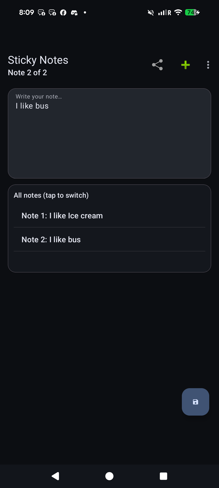
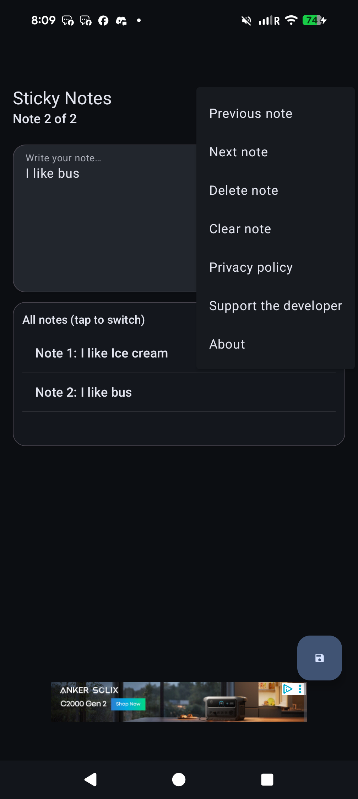
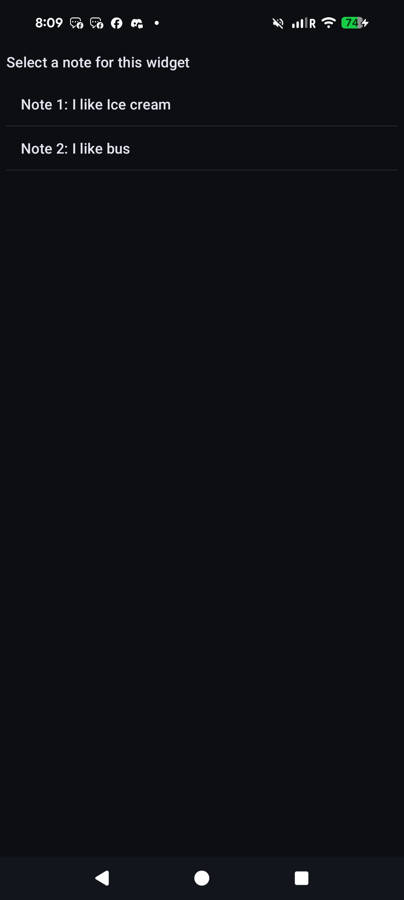
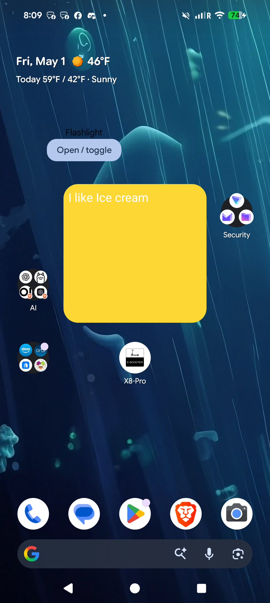

# Sticky Notes

A clean and fast sticky note app for Android, built for people who want quick writing and easy access from the home screen.

## Quick Links

- Website: [Sticky Notes Site](https://chartmann1590.github.io/StickyNotes/)
- Privacy Policy: [View policy](https://chartmann1590.github.io/StickyNotes/privacy-policy.html)
- Source Code: [GitHub Repository](https://github.com/chartmann1590/StickyNotes)
- Releases: [Download builds](https://github.com/chartmann1590/StickyNotes/releases)
- Sponsor: [Buy Me a Coffee](https://buymeacoffee.com/charleshartmann)

## Why You Might Like It

- Multiple notes in one app
- Easy tap-to-switch note list
- Home-screen widgets linked to specific notes
- Fast, modern interface with dark-mode friendly design

## Real Screenshots (Pixel 8 Pro)

### Main Writing Screen

### Quick Actions Menu

### Widget Note Selection

### Home Screen Widget

## Support the Project

If you enjoy using Sticky Notes and want to support future updates:

[buymeacoffee.com/charleshartmann](https://buymeacoffee.com/charleshartmann)

## Privacy

You can always view the latest privacy policy here:

[https://chartmann1590.github.io/StickyNotes/privacy-policy.html](https://chartmann1590.github.io/StickyNotes/privacy-policy.html)
